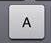
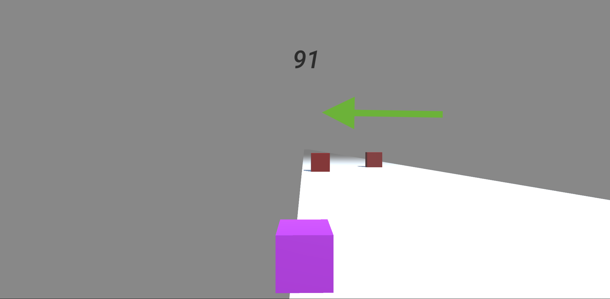
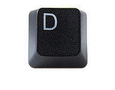
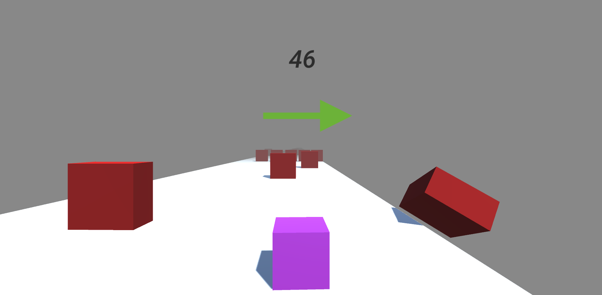

# BoxSlider
Welcome to BoxSlider! This is a 3D Unity Game that will test your reflexes! So get ready and let's have some fun :)

## How To Play

<strong> Press A to Move Left </strong>

<strong>Press D to Move Right</strong>

## Objective
### DO NOT HIT THE RED BLOCKS OR FALL OFF THE ROAD!! :x:
#### <em> May the best box win </em> :trophy: :sunglasses:

## Gameplay
<video width="320" height="240" controls>
  <source src="/Demo/Gameplays.mov" type="video/mp4">
</video>

